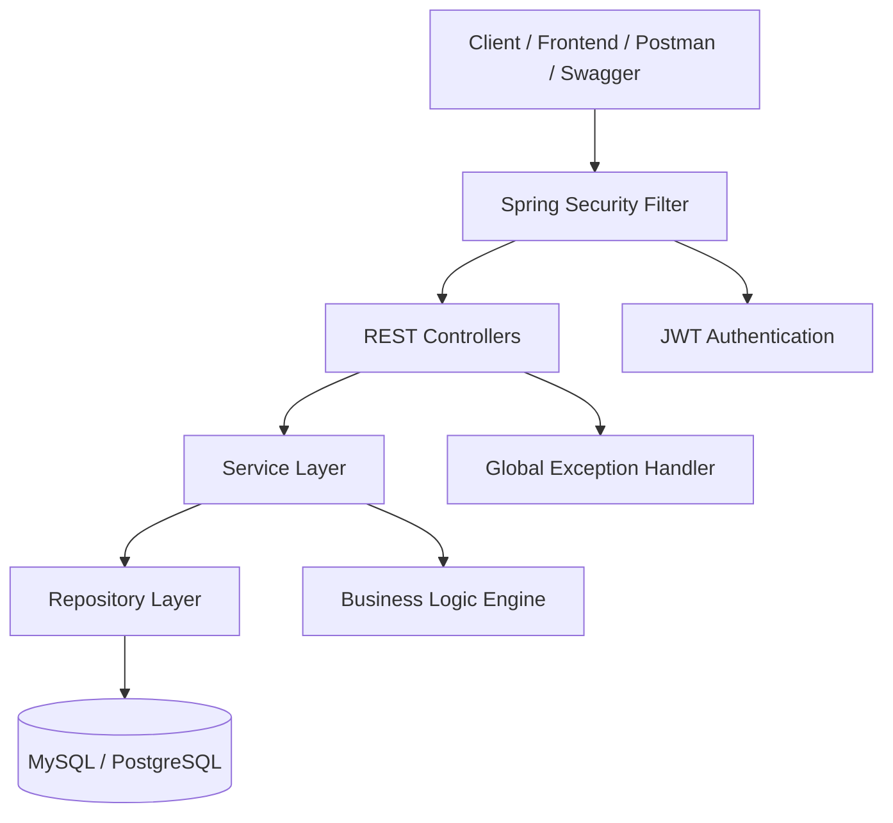
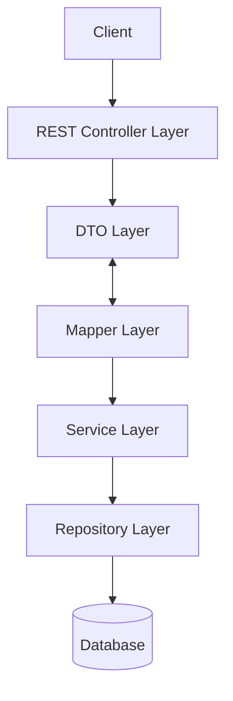
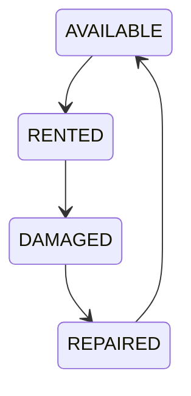
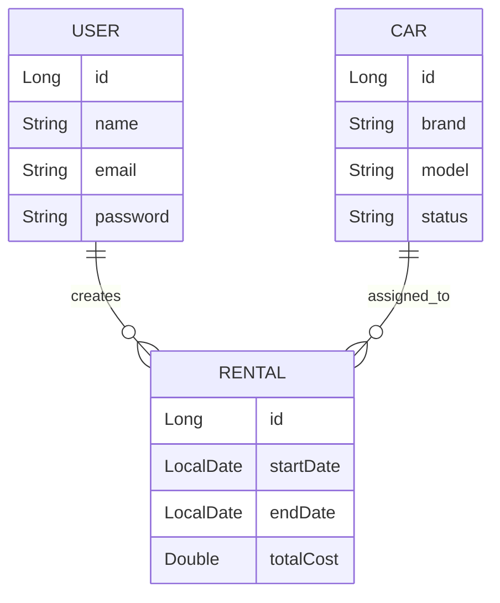
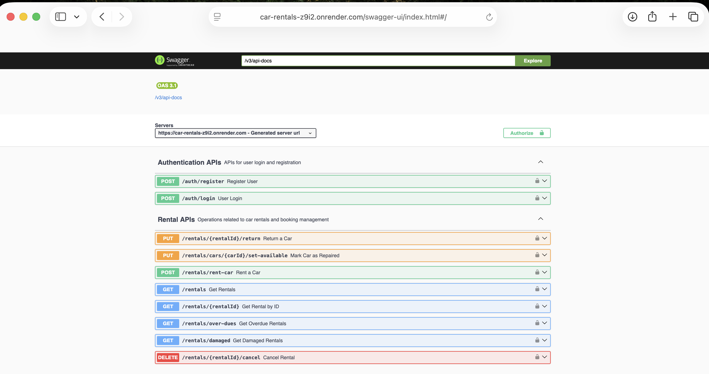
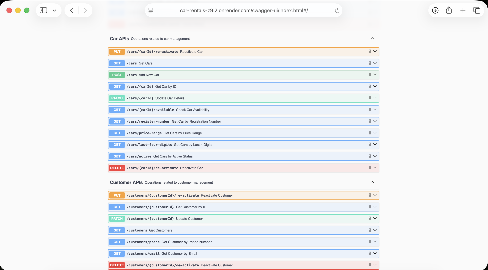
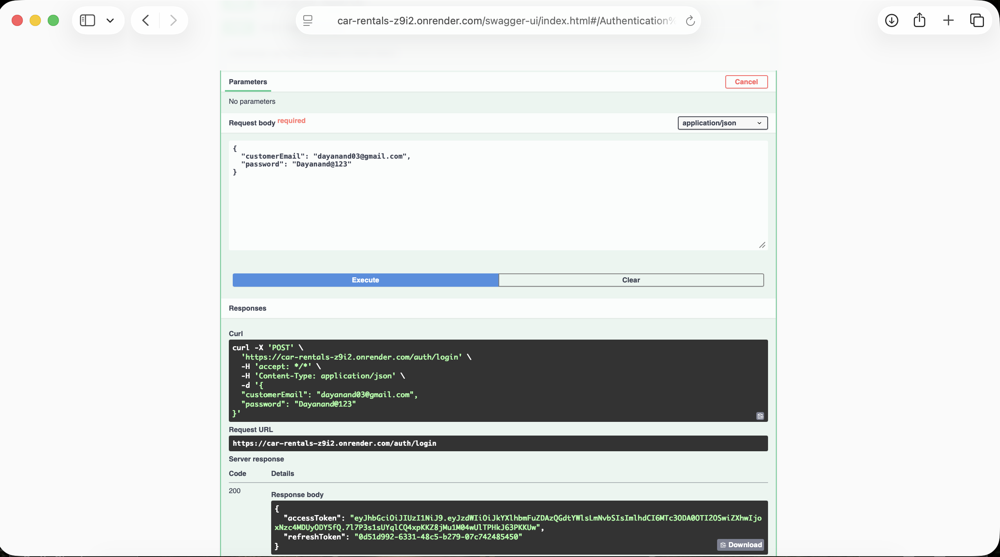
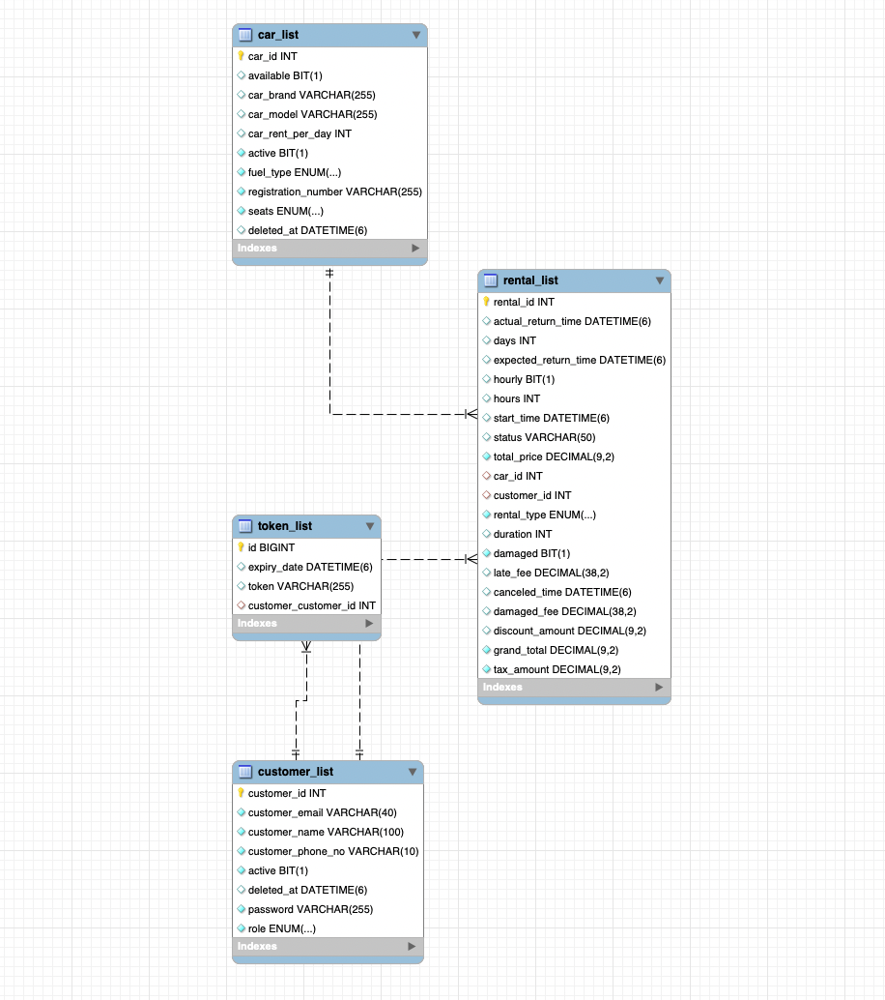

# 🚗 Car Rentals Platform
**Enterprise-grade backend system for managing car rental operations with real-world business logic, security, and scalable architecture.**

<p align="center">
  <b>Built with Java • Spring Boot • JWT • Docker • PostgreSQL</b>
</p>

<p align="center">
  <a href="https://car-rentals-z9i2.onrender.com">🌐 Live Demo</a> •
  <a href="https://car-rentals-z9i2.onrender.com/swagger-ui/index.html">📄 API Docs</a>
</p>

---

# 🧠 Product Vision

This project is designed as a real-world car rental backend system, inspired by platforms like Zoomcar and Hertz.

It focuses on:
- Accurate billing & pricing logic
- Secure authentication & authorization
- Data integrity & maintainability
- Scalable backend architecture
- Real-world rental lifecycle management

---

# ✨ Key Highlights

- 💰 **Advanced Pricing Engine**  
  Calculates total rental cost including taxes, late fees, and damage penalties

- 🔄 **Soft Delete Strategy (Production Pattern)**  
  Uses `ACTIVE / INACTIVE` states instead of deletion to preserve historical data

- 🔧 **Damage & Repair Lifecycle**  
  Cars move through states: `AVAILABLE → RENTED → DAMAGED → REPAIRED → AVAILABLE`

- 📊 **Operational Insights**  
  Track overdue rentals and damaged rentals separately

- 🔐 **JWT-Based Security**  
  Stateless authentication with secure API access

- 📄 **Interactive Swagger Documentation**  
  Explore and test APIs directly

- 🐳 **Dockerized Deployment**  
  Containerized for easy deployment and scalability

---

---

# 📈 Project Scale

- 30+ REST APIs
- Layered enterprise architecture
- JWT secured endpoints
- Dockerized application
- PostgreSQL production deployment
- Swagger API documentation
- Production-ready exception handling

---

# 🏗️ System Architecture

## 📌 High-Level Architecture



---

## 🧩 Internal Layered Architecture



---

## 🚘 Rental Lifecycle Workflow



---

# 🗄️ Database Design

## 📌 Core Entities

- User
- Car
- Rental

## 🧩 Entity Relationship Diagram


---

# 📌 Design Decisions

- Soft delete using status fields
- Relational mapping using JPA/Hibernate
- Normalized database schema
- Production-oriented entity relationships

---

# ⚙️ Cross-Cutting Concerns

- 🔐 JWT Authentication Filter
- ⚠️ Global Exception Handling
- 🔄 Transaction Management
- 🧾 DTO Mapping Layer
- 📊 Validation & Error Responses

---

# 🔐 Security Features

- JWT Stateless Authentication
- BCrypt Password Encryption
- Protected Secure APIs
- Token Validation Filter
- Unauthorized Access Handling
- Secure Authentication Flow

---

# 📌 Core API Modules

| Module | Features |
|---|---|
| Authentication | Login & JWT token generation |
| Car Management | Add, update, availability tracking |
| Rental Management | Rent, return, overdue handling |
| Pricing Engine | Billing, penalties, tax calculations |
| Damage Management | Damage & repair tracking |
| Reporting | Operational insights |

---

# 🏭 Production-Oriented Design Decisions

- Layered architecture for maintainability
- DTO pattern to avoid entity exposure
- Centralized exception handling
- Stateless authentication
- Environment-based configuration
- Production deployment using PostgreSQL
- Docker containerization support

---

# 🛠️ Tech Stack

## Backend
- Java 17+
- Spring Boot
- Spring Security
- Spring Data JPA (Hibernate)

## Database
- MySQL (Development)
- PostgreSQL (Production)

## Dev Tools
- Swagger (OpenAPI)
- Docker
- Maven

---

# 📁 Project Structure

```text
src/main/java/com/carrentals
│
├── controller
├── service
├── repository
├── entity
├── dto
├── mapper
├── security
├── config
├── exception
└── util
```

---

# ⚙️ Getting Started

## 🔧 Prerequisites
- Java 17+
- Maven
- MySQL

---

# 📥 Clone the Repository

```bash
git clone https://github.com/dayanand0304/Car_Rentals.git
cd Car_Rentals
```
---

# ⚙️ Configure Database

~~~properties
spring.datasource.url= jdbc:mysql://localhost:3306/car_rentals
spring.datasource.username= your_username
spring.datasource.password= your_password
~~~
---

# ▶️ Run Locally

```bash
  mvn clean install
  mvn spring-boot:run
```

---

# 🐳 Run with Docker

```bash
  docker build -t car-rentals .
  docker run -p 8080:8080 car-rentals
```

---

# 🔐 Authentication Flow

```text
User Login
    ↓
Generate JWT Token
    ↓
Send Token in Header
    ↓
Validate Token
    ↓
Access Secured APIs
```

## Authorization Header

```http
Authorization: Bearer <JWT_TOKEN>
```

---


# 📚 API Documentation

<p align="left">
  <a href="https://car-rentals-z9i2.onrender.com/swagger-ui/index.html">📄 Swagger Documentation</a>
</p>

### Features 
 
- Test APIs directly
- Explore request/response schemas
- Understand endpoint flows
- Validate secured APIs

---

# 🧪 API Example

## 🔑 Login API

### Endpoint

```http
POST /api/auth/login
```

---

### Request

```json
{
  "email": "example@gmail.com",
  "password": "Password@123"
}
```

---

### Response

```json
{
  "token": "your_jwt_token"
}
```

---

# 📸 Screenshots

## Swagger Documentation 

<p align="center">
  
</p>

---

## All APIs

<p align="center">
  
</p>

---

## JWT Login Response

<p align="center">
  
</p>

---

## Database Schema

<p align="center">
  
</p>

---


# 📦 Deployment

<p align="left">
  <a href="https://car-rentals-z9i2.onrender.com"> 🌐 Live Application</a>
</p>

- Deployed and accessible via public URL with fully functional APIs.

## 🚀 Deployment Stack

- Render (Cloud Hosting)
- PostgreSQL (Production Database)
- Environment-based configuration

---

# 🧪 Testing

## Manual API Testing using:
- Swagger UI
- Postman

---

# 🚀 Future Enhancements

- 🧪 Add JUnit & Mockito testing
- 🔗 Integration testing with Spring Boot Test
- ⚙️ CI/CD using GitHub Actions
- 📦 Multi-stage Docker builds
- 📊 Monitoring with Spring Actuator & Prometheus
- 📧 Email notification system
- 📱 Frontend integration

---


# 📄 License

This project is licensed under the MIT License.

---

## 👨‍💻 Author

**Dayanand**  
Backend Developer | Java & Spring Boot

- GitHub: https://github.com/dayanand0304

---

